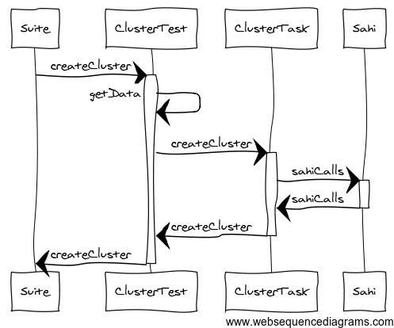
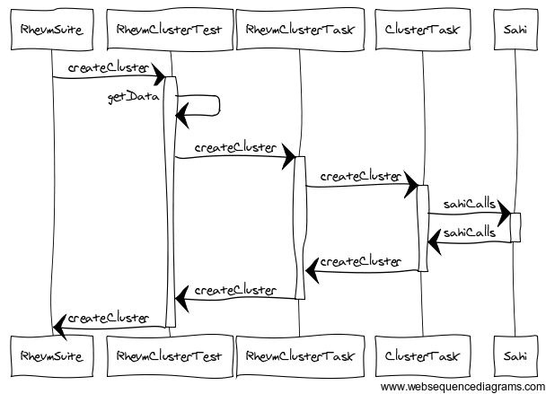
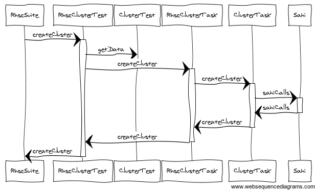
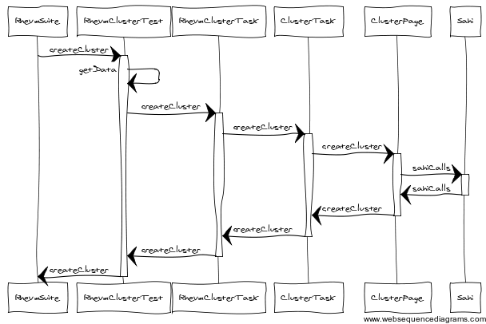

!SLIDE 
# Tweaking for Rhevm #

!SLIDE bullets incremental
# goals #
* discuss possible implementation options and tradeoffs
* make implementation as flexible as possible
* tweak our current design

<!SLIDE center >
# Example createCluster() #
* just want to fill in some extra fields in loginTask
 

<!SLIDE center >
# ClusterTask #
 

<!SLIDE center >
#favor composition over inheritance? #
* are we violating LSP (Liskov substitution principle)? 
* trading extra typing for less flexability

<!SLIDE center>
# our new sequence diagram #
 
* note need a second Test Environment, Test Suite, Ant Task, Test class, Task class

<!SLIDE center >
 

<!SLIDE smallestest>
# what's this code look like #
ClusterTask  
...  

	@@@ java
	  public boolean createNewCluster(ClusterMap cluster){
	    if(!storageSahiTasks.selectPage(cluster.getResourceLocation())){
	      return false;
	    }
	    
	    if(cluster.isPositive()) {
	      if (storageSahiTasks.div(cluster.getClusterName()).exists()) {
	        storageSahiTasks._logger.log(Level.WARNING, "Cluster ["+cluster.getClusterName()+"] is already on the list!");
	        return false;
	      }
	    } else {
	      if (!storageSahiTasks.div(cluster.getClusterName()).exists()) {
	        storageSahiTasks._logger.log(Level.WARNING, "Pre-Requirement not met: Cluster ["+cluster.getClusterName()+"] not available on the available list!");
	        return false;
	      }
	    }
	    
	    storageSahiTasks.div("MainTabClusterView_table_New").click();
	    storageSahiTasks.textbox("ClusterPopupView_nameEditor").setValue(cluster.getClusterName());
	    storageSahiTasks.textbox("ClusterPopupView_descriptionEditor").setValue(cluster.getClusterDescription());
	    storageSahiTasks.div("ClusterPopupView_OnSave").click();
	    
	    if (cluster.isPositive()) {
	      storageSahiTasks.div("GuidePopupView_Cancel").click();
	      storageSahiTasks.clickRefresh("Cluster");
	      storageSahiTasks._logger.log(Level.INFO, "Table: "+GuiTables.getClustersTable(storageSahiTasks));
	      
	      if(!storageSahiTasks.div(cluster.getClusterName()).exists()){
	        storageSahiTasks._logger.log(Level.WARNING, "Cluster["+cluster.getClusterName()+"] is not available on the list!");
	        return false;
	      }
	    } else {
	        if(storageSahiTasks.div("/" + cluster.getErrorMsg() + "/").exists()) {
	          storageSahiTasks._logger.log(Level.FINE, "Volume ["+cluster.getClusterName()+"] creation error pop-up appeared!");
	          storageSahiTasks.closePopup("Close");
	          storageSahiTasks.div("ClusterPopupView_Cancel").click();
	          return true;
	        } else {
	          storageSahiTasks._logger.log(Level.WARNING, "Volume ["+cluster.getClusterName()+"] creation error pop-up did not appear!");
	          return false;
	        }
	    }   
	    
	    return true;
	  }

<!SLIDE smallest>
pull a few methods out

	@@@ java
	  public boolean createNewCluster(ClusterMap cluster){
	    storageSahiTasks.selectPage(cluster.getResourceLocation());
	
      validateCreateNewClusterPreconditions(cluster);
	
	    storageSahiTasks.div("MainTabClusterView_table_New").click();
	    fillInClusterModalFields(cluster);
	    storageSahiTasks.div("ClusterPopupView_OnSave").click();
	    
	    if (cluster.isPositive()) {
	      storageSahiTasks.div("GuidePopupView_Cancel").click();
	      validateExistenceOfNewCluster(cluster);
	    } else {
	        validatePresenceOfErrorMessage(cluster);
	    }
	    return true;
	  }

<!SLIDE smallest code >
# RhevmTask #
	@@@ java
	public class RhevmClusterTasks extends StorageSahiClusterTasks{
	
	  public RhevmClusterTasks(StorageSahiTasks tasks) {
	    super(tasks);
	  }
	
	  @Override
	  protected void fillInClusterModalFields(ClusterMap cluster) {
	    super.fillInClusterModalFields(cluster);
	    fillInNewClusterRhevmSpecificFields(cluster);
	  }
	
	  private void fillInNewClusterRhevmSpecificFields(ClusterMap cluster){
	    storageSahiTasks.select("ClusterPopupView_cPUEditor").choose(cluster.getCPUName());
	    storageSahiTasks.select("ClusterPopupView_versionEditor").choose(cluster.getCompatabilityVersion());
	    if(cluster.isGlusterService()){
	      storageSahiTasks.radio("ClusterPopupView_enableGlusterServiceOption").check();
	    }else{
	      storageSahiTasks.radio("ClusterPopupView_enableOvirtServiceOption").check();
	    }
	  }
	  
	  @Override
	  public LinkedList<HashMap<String, String>> getClusterTable() {
	    return RhevmGuiTables.getClustersTable(storageSahiTasks);
	  }
	
	}

<!SLIDE smallest>
# RhevmTest #
	@@@ java
	public class RhevmClusterTest extends ClusterTest  {
	
	  @Override
	  public ClusterTaskable defineTasks() {
	    return new RhevmClusterTasks(getBrowser());
	  }
	  
	  @DataProvider(name="clusterCreationData")
	  public Object[][] blah(){
	    ArrayList<Object> rhevmData = new ArrayList<Object>();
	    Object[][] dataItems = super.getAlertCreationData();
	    for(Object[] dataItem: dataItems){
	      ClusterMap cluster = (ClusterMap)dataItem[0];
	      cluster.setCpuName("Intel SandyBridge Family");
	      cluster.setCompatabilityVersion("3.2");
	      rhevmData.add(cluster);
	    }
	    return this.convertListTo2dArray(rhevmData);
	    
	  }
	
	}

<!SLIDE>
# page object metaphor #
 
* for tasks, what are the implications for composition over inheritance

<!SLIDE smaller >
	@@@ java
	  @Override
	  public boolean createNewCluster(ClusterMap cluster){
	    page.navigateTo();
	  
	    validateCreateNewClusterPreconditions(cluster); 
	  
	    page.getNewButton().click();
	    page.getCreateModal().fillInFields(cluster);                                                                                                                                                               
	    page.getCreateModal().getCreateButton().click();
	    
	    if (cluster.isPositive()) {
	      page.getGuideMeModal().getCancelButton().click();
	      validateExistenceOfNewCluster(cluster);
	    } else {
	        validatePresenceOfErrorMessage(cluster);
	    }
	    return true;
	  }

<!SLIDE smallest>
	@@@ java
	public class RhevmClusterTasks extends StorageSahiClusterTasks{
	
	  public RhevmClusterTasks(StorageSahiTasks browser) {
	    super(new RhevmClusterPage(browser));
	  }
	  
	} 

<!SLIDE incremental >
# some extra things I'd like#
* Rename StorageConfiguration to TestBase  (test != configuration not supposed to inherit just for functionality)
* Rename StorageExtendedSahi to ExtendedBrowsr (that's what it is, a Browser object)
* Remove StorageSahiTasks ( we don't need this )

